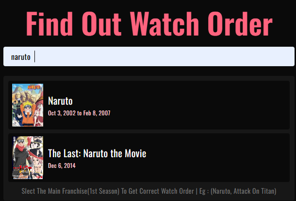

# Hana Anime Watch Order App (Beta)

Hana Anime Watch Order App is a modern Anime Watch Order Generator built with React that automatically
generates the correct viewing order for anime series using anime relation data.

### Live Demo

[Live Preview](https://hana-anime-watch-order.vercel.app/)

## About The Project

Finding the correct watch order for complex anime franchises can be confusing, especially for series with multiple seasons, movies, OVAs, and specials.

### Hana Anime Watch Order App solves this problem by:

- Searching anime titles
- Fetching anime relation data
- Automatically generating the correct viewing order (Release Order)
- It For now only generates the release Order which works for most of the anime expect anime like Steins;Gate, Clannad, Fate series

This project is currently in Beta (v0.1.0) and represents the foundation of a more advanced anime recommendation and watch-order system.
This site is only for desktop right now but I will make the mobile version in future

## Features

- Search for anime
- View related anime
- Generate correct watch order
- Its slow for big franchises like Naruto, Attack on titan because it takes time to fetch data and also due to jikan api call limit 3calls/second window

## Tech Stack

- Frontend: React.js + TailwindCSS
- API: Jikan API (Unofficial MyAnimeList API)
- Deployment: Vercel
- Package Manager: npm / Node.js

## ScreenShots





## Future Plans

- Improve UI and animations
- Mobile Version
- Optimize API performance
- Add Backend and Database
- Make it faster by adding its own database

````md
## 📦 Installation

To run this project locally:

```bash
git clone https://github.com/ari-kashimu/Hana-Anime-Watch-Order-App.git
cd Hana-Anime-Watch-Order-App
npm install
npm run dev


```
````

## License

This project is licensed under the MIT License
