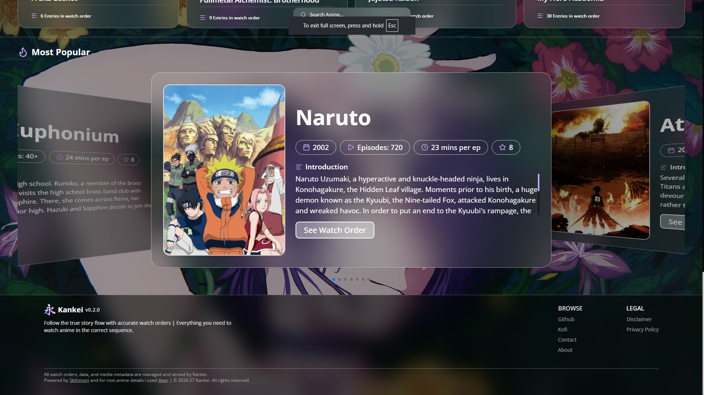

# Kankei Anime Watch Order App (0.2.0)

kankei Anime Watch Order App is a modern Anime Watch Order Generator built with React that automatically
generates the correct viewing order for anime series using anime relation data.

### Live Demo

[Live Preview](https://kankei-anime-watch-order.vercel.app/)

## About The Project

Finding the correct watch order for complex anime franchises can be confusing, especially for series with multiple seasons, movies, OVAs, and specials.

### Kankei Anime Watch Order App solves this problem by:

- Searching anime titles
- Fetching anime relation data
- Automatically generating the correct viewing order (Release Order)
- It For now only generates the release Order which works for most of the anime expect anime like Steins;Gate, Clannad, Fate series

This project is currently in Beta (v0.2.0) and represents the foundation of a more advanced anime recommendation and watch-order system.

## ScreenShots

## Future Plans

- Adding chronological order OR recommended order
- Login/Signin

## License

This project is licensed under the MIT License
